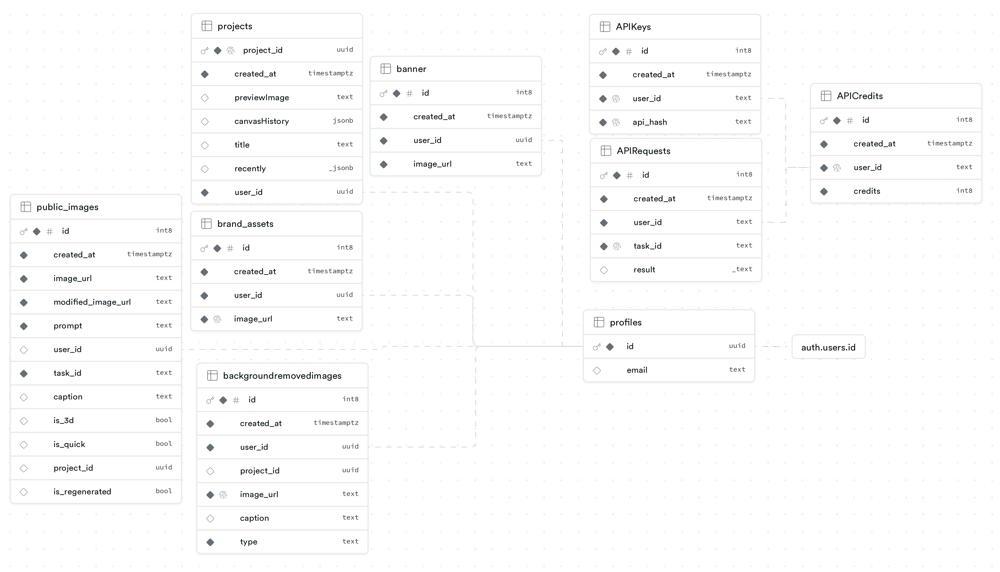

# Flipkart AI

## Modal Code
The modal code is in the `modal-code` folder, it contains the code for the ML model used for generating images, upscaling and removing the background.

## Celery worker
There are two folders in `celery`, one is celery task adder and the other is celery worker, both are dockerized for easy deployment.

The celery task adder is a flask app that adds a task to the celery queue, it receives a post request with a json body that contains the task name and the task arguments, then it adds the task to the celery queue.

The celery worker is a celery worker that runs the task.

## Frontend
The main website of Flipkart Ai

### Setting up the supabase
# IMPORTANT:
### If you want to modify the table names or anything please follow instructions under Using Different Table Names

## Using Same Table Names to quickly dump the existing schema of our database
### This is the easiest way to setup the database
You can create a new supabase project and run the following commands to setup the database
```bash
supabase init
```

Then link the project to the supabase project you created

```bash
supabase link
```

Then run the following commands in [schema.sql](schema.sql) in SQL editor of supabase to create the tables and setup everything real quick

## Using Different Table Names
Before setting up this project create a supabase table with the following sql query, it creates a profile table that stores the user's email and id, and also creates a trigger that automatically adds the user to the profile table when they sign up.

```sql
create table
  profiles (
    id uuid references auth.users on delete cascade not null primary key,
    email text
  );

alter table profiles enable row level security;

create policy "Public profiles are viewable by everyone." on profiles for
select
  using (true);

create policy "Users can insert their own profile." on profiles for insert
with
  check (auth.uid () = id);

create policy "Users can update own profile." on profiles
for update
  using (auth.uid () = id);

create or replace function public.handle_new_user() 
returns trigger as $$
begin
  INSERT INTO public.profiles (id, email)
  values (new.id, new.email)
  ON CONFLICT (id) 
  DO 
    UPDATE SET email = new.email;
  return new;
end;
$$ language plpgsql security definer;

drop trigger if exists on_auth_user_created on auth.users;
create trigger on_auth_user_created
after update or insert on auth.users for each row
execute procedure public.handle_new_user ();
```

## Ensure you created tables given in Schema.jpg and then create the following functions


Also create the following storage buckets in supabase, and then populate the bucket names in th .env file of the frontend and celery worker
 - BRAND_ASSETS_BUCKET
 - API_REQUEST_BUCKET
 - GENERATED_IMAGES_BUCKET
 - SUPABASE_REQUEST_IMAGES_BUCKET

The following functions are used for the website

```sql
CREATE OR REPLACE FUNCTION regenerate_add_to_gallery(image_urls_arg text[], user_id_arg uuid, project_id_arg uuid) returns void as $$
BEGIN
-- Change the table name here to the name of your table, here it is public_images
  UPDATE public_images
  SET is_regenerated = false
  WHERE modified_image_url = ANY(image_urls_arg)
  AND user_id = user_id_arg
  AND project_id = project_id_arg;
END;
$$ language plpgsql;
```

# This is used for API service not needed for website
```sql
create
or replace function check_api_key_and_credits (api_key_arg text, task_id_arg text) returns table (should_process boolean) as $$
DECLARE
  credits_var INT;
  user_id_var text;
BEGIN
  -- Check if the user has a job running
  EXECUTE FORMAT('SELECT user_id FROM %I WHERE api_hash = $1', 'APIKeys')
  INTO user_id_var
  USING api_key_arg;

  IF user_id_var IS not null THEN
    -- Create Task
    -- Update the table name here to the name of your table, here it is APIRequests
    INSERT INTO "APIRequests" (user_id, task_id) VALUES (user_id_var, task_id_arg);

    -- Get credits
    -- Update the table name here to the name of your table, here it is APICredits
    EXECUTE FORMAT('SELECT credits FROM %I WHERE user_id = $1', 'APICredits')
    INTO credits_var
    USING user_id_var;

    -- Update APICredits
    -- Update the table name here to the name of your table, here it is APICredits
    EXECUTE FORMAT('UPDATE %I SET credits = $1 + 1 WHERE user_id = $2', 'APICredits')
    USING credits_var, user_id_var;
  END IF;

  -- Return credits and job_running in a single record with field names
  RETURN QUERY SELECT user_id_var is not null;
END;
$$ language plpgsql;
```